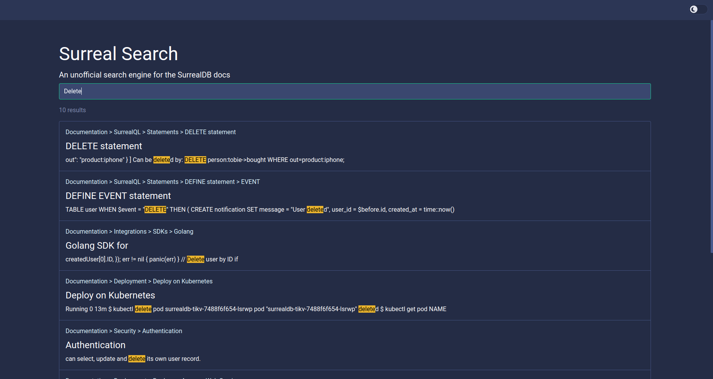

# Surreal Search

An unofficial search engine for the SurrealDB documentation.



## Development

### 1. Spin up a Typesense cluster
This project uses Typesense as the search engine. You can use the `docker-compose.yml` file in the `typesense` directory to spin up a local Typesense cluster.
```
cd typesense && docker compose up -d
```

### 2. Create a `.env` file. You can copy the `.env.example` file for this which is pre-configured to work with the local Typesense cluster.

### 3. Build the binary

Run the following command to create a `sursearch` binary in the project root
```
make build
```

### 4. Build the Typesense index

Run `sursearch` with the `index` command to build the Typesense index. This will crawl through the entire SurrealDB documentation site.
```
./sursearch index
```

Run with --help to see full list of flags:
```
$ ./sursearch index --help
This command will (re-)build the index of the SurrealDB docs site in Typesense

Usage:
  sursearch index [flags]

Flags:
  -d, --depth uint8    Max depth to crawl for links (default 5)
  -h, --help           help for index
  -w, --workers uint   Number of workers to use (default 50)
```

### 5. Start the API server

Run `sursearch` with the `serve` command which will spin up an API with a `/search` endpoint.
```
./sursearch serve
```

Run with --help to see full list of flags:
```
$ ./sursearch serve --help
Start the Backend API

Usage:
  sursearch serve [flags]

Flags:
  -h, --help        help for serve
  -p, --port uint   Port to run server on (default 8080)
```

### 6. Run the web app

Create a `.env.local` file from the `.env.example` file. The API url is configured to be the default port of the `serve` command above.

From the `app` directory, run:
```
pnpm dev
```
OR
```
npm run dev
```

Visit the app at http://localhost:5173/
